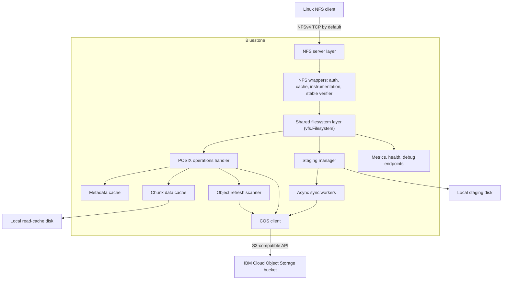
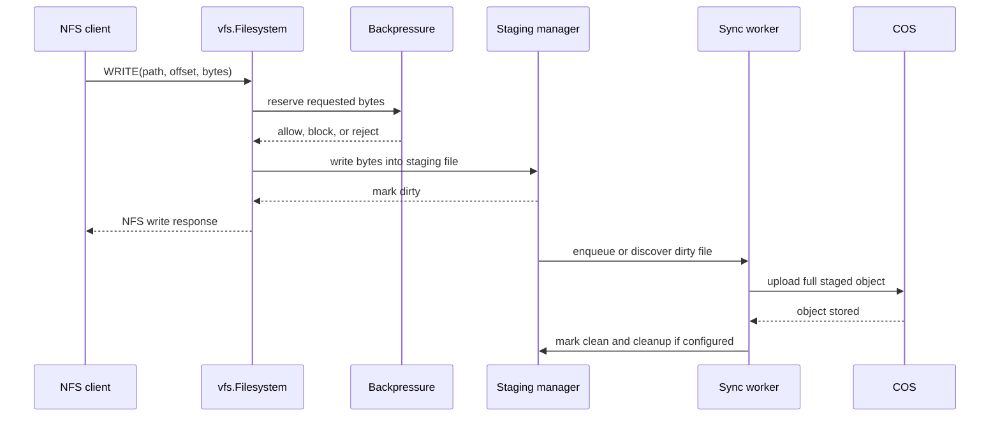

# Bluestone Architecture

## Overview

Bluestone exposes a single IBM Cloud Object Storage bucket as an
NFSv4 filesystem by default, with optional NFSv3 compatibility. Linux clients
speak NFS to the gateway; the gateway translates filesystem operations into COS
object operations and uses local disk for staging, write-back sync, and read
caching.

For a direct comparison with AWS's newer S3 file-access direction, see
[`docs/AWS_S3_FILES_COMPARISON.md`](docs/AWS_S3_FILES_COMPARISON.md).

The current architecture is intentionally centered on local correctness:

- Writes are accepted into local staging first.
- Background workers sync dirty staged files to COS asynchronously.
- Read paths prefer dirty/staged data when present, then local cache, then COS.
- Object-side COS changes converge through cache expiry or optional refresh
  scans.
- Backpressure protects staging capacity before the local filesystem is full.
- Multipart uploads are owned by final sync workers and protected from
  per-object races.
- Crash recovery scans staging metadata and resumes unsynced dirty files.

## High-Level Architecture



## Request Flow

### NFS Layer

The gateway serves NFSv4 over TCP by default, normally on port `2049`. It can
also serve NFSv3 or dual NFSv3/NFSv4 from the same listener when configured.
The NFS stack is built on a vendored `go-nfs` dependency with local changes
needed for gateway behavior, including filesystem statistics forwarding,
NFSv4 COMPOUND handling, deterministic ENOSPC mapping, and concurrent
per-connection request handling: Linux clients multiplex a whole mount over
one TCP connection, so each request body is buffered as it is read and
dispatched to a bounded handler pool (default 64 per connection, like a kernel
nfsd thread pool). RPC replies carry XIDs so out-of-order completion is legal,
and NFSv4.0 clients serialize seqid-ordered state operations per owner
themselves (RFC 7530 section 9.1.7). Per-connection parallelism is tunable via
`server.nfs_concurrent_handlers` (1 restores serial handling). When
`server.allowed_clients` is set, connections from addresses outside the listed
CIDRs/IPs are dropped at TCP accept, before any RPC bytes are parsed, and
logged — the same trust model as cloud security groups.

The NFSv4 server implements advisory byte-range locking (LOCK, LOCKT, LOCKU,
RELEASE_LOCKOWNER) with POSIX semantics: same-owner overlaps replace,
different-owner conflicts return DENIED with the conflicting lock described,
`fcntl` and `flock` both work from Linux clients. Locks are advisory only —
never enforced against READ or WRITE — matching the managed-cloud file
gateway model. Held ranges live in the shared lock table (`internal/lock`)
that every protocol server uses, so locks will conflict across protocols;
NFSv4 stateids and client leases stay in the NFS layer. Lock state is
in-memory in the single gateway that owns the export, capped at 512 locks per
file and 8,192 per client, and expires when a client stops renewing its lease
(90s lease, 3 lease periods of grace). Lock state does not survive a gateway
restart; reclaim attempts after restart return NFS4ERR_NO_GRACE and
applications must re-acquire.

The request path is:

1. NFS client sends an NFSv4 COMPOUND request or an enabled NFSv3 operation.
2. `go-nfs` decodes the request.
3. wrapper handlers apply caching, instrumentation, and stable directory
   verifier behavior.
4. the shared filesystem layer (`vfs.Filesystem`) handles filesystem semantics.
5. operations are routed to staging, cache, or COS depending on file state.

### Write Path

Writes use local staging when `staging.enabled` is true.



An accepted write means the gateway accepted data into local staging. It does
not mean the object is already durable in COS. COS durability happens after the
background sync worker uploads the staged file and the object is visible in the
bucket.

Dirty files are tracked by staging metadata. Sync can be triggered by size,
dirty age, close behavior, explicit queueing, or periodic scans depending on
configuration.

### Read Path

Reads follow a consistency-first order:

1. If a file is dirty, syncing, or otherwise has active staged state, read from
   staging.
2. If the requested range exists in the local chunk cache, read from cache.
3. Otherwise fetch from COS using object/range reads.
4. Populate the chunk cache when configured.

Warm reads are served with one ranged read per cached chunk, returning exactly
the requested bytes without materializing whole chunks. Read-ahead engages
only when the request misses the cache, is clamped to the known object size
(no past-EOF range requests), and uses parallel range fetches. Repeated
concurrent fetches for the same range are deduplicated with singleflight to
avoid stampeding COS.

### Object-Store Outage Behavior

The gateway keeps the export functional while COS is unreachable, verified by
fault injection with two clients under full write/read/delete/rename/lock
churn (zero errors across a 3-minute total outage):

- Startup proceeds in degraded mode when COS cannot be reached, so crash
  recovery works during an outage; staged dirty files are recovered and the
  export comes back.
- Writes are accepted into staging as always. Reads of dirty or retained
  staged files are served locally; cached chunks keep serving.
- Metadata answers fall back in order: fresh cache, staged state (a session
  answers for its file; staged data under a path proves the directory), then
  stale cache entries including stale negatives derived from parent listings.
  Backend failures are surfaced as I/O errors, never as false ENOENT.
- Deletes that cannot reach COS are accepted through the same durable
  tombstones used for dirty-file deletes: the path disappears immediately and
  the sync worker retires the object when the backend heals.
- Readdir serves staged entries when the object store cannot answer.

Operations with no local truth still fail until the backend responds: cold
reads of never-cached data, creation of new directories, renames of clean
files, and writable opens that keep an existing file's content when that
content is not already staged. Refusing those opens is deliberate: the
object's bytes cannot be staged, and writes to an empty staged copy would
replace the object on sync. Truncating creates still work. Retaining staged
data after sync (`staging.clean_after_sync: false`) widens local coverage:
everything written since the staged copies were last cleaned remains
readable through an outage.

### Directory And Metadata Path

Object keys are translated into filesystem paths. Directory listings are
constructed from COS prefix listings plus local staged state. Metadata cache
entries store file attributes and directory listings with TTL-based expiration.

Write, remove, rename, and metadata-changing operations invalidate relevant
cache entries so clients do not keep reading stale metadata through the gateway.
Mutations invalidate the target path, affected parent and ancestor directory
listings, and affected data cache entries. Directory rename and delete also
invalidate cached data under the affected prefixes so range/chunk reads do not
serve stale bytes through old logical paths.

### File Attributes

POSIX attributes (mode, owner, and times) are stored in COS user metadata
under the keys `mode`, `uid`, `gid`, `atime`, `mtime`, and `ctime`.
Attributes that earlier gateway versions stored under double-prefixed keys
still decode, and are rewritten under the current keys on the next attribute
change.

- `chmod`, `chown`, and time changes on synced files are metadata-only
  copy-in-place updates that keep unrelated user metadata; they do not
  rewrite file contents.
- Staged files carry the mode and owner of the object they replace, so
  editing a file does not reset them on sync. Those attributes are persisted
  in the staging sidecar, so crash recovery and staged renames keep them.
- COS listings do not return object metadata. Directory listings reuse
  attributes cached from a recent stat when the listed size and modification
  time still match, and report defaults otherwise.
- A modification time a client sets (`utimes`, or Windows setting the write
  time) is stored in object metadata and reported back by stat, instead of the
  object's own last-modified, which COS rewrites on every upload. Writing to
  the file moves the modification time again. Directory listings still report
  the object's last-modified unless an earlier stat cached the file's
  attributes, because COS listings carry no user metadata.
- Creation time (`btime`) and Windows attribute flags (`windows-attributes`:
  read-only, hidden, system, archive) are stored and preserved the same way,
  including through sync uploads. Files the gateway creates record their
  creation time when created; objects without a stored creation time report
  their modification time instead.

### Windows Naming

Object keys are case-sensitive and may contain characters Windows cannot use
in names. A filesystem view created with `WithWindowsNames` (intended for the
SMB server; NFS views keep exact names) follows Windows naming:

- Names match case-insensitively. An exact match wins; otherwise the first
  matching key in byte order. Listings still show every key, so keys that
  differ only by case stay visible. Creating a name that matches an existing
  key opens that key, and a rename that changes only case renames the key.
- Characters Windows cannot use (`" * : < > ? \ |`, control characters, and
  trailing spaces or periods) are presented as Unicode private-use characters
  (the Services for Macintosh mapping used by macOS, the Linux CIFS client,
  and Samba) and map back to the stored key.
- Lookups consult the directory listing (cached) plus staged files, so files
  that exist only in staging resolve too. Keys that already contain the
  private-use characters are ambiguous under this mapping.

### SMB Server

`internal/smb` serves a Windows-naming view of the shared filesystem through
the vendored go-smb-server library (`third_party/go-smb-server`, see its
`VENDOR.md`). The adapter maps SMB create dispositions onto filesystem opens.
Existing files are opened read-only and switch to a writable open on the
first write, truncate, or attribute change, because a writable open of an
existing object downloads it into staging and SMB clients open files with
write access they often never use. Set-info requests map to truncate and
`SetAttributes` (creation, write, and access times, Windows attributes).
Connections outside `server.allowed_clients` are dropped at accept.

### Byte-Range Locks

Both protocol servers record locks in `internal/lock.Manager`: NFSv4 through
`internal/nfs.NewLocker` and SMB through `internal/smb.NewLocker`, which the
vendored server calls through its `vfs.ByteRangeLocker` interface. A lock
taken over one protocol therefore conflicts with a lock taken over the other.
An SMB lock belongs to the file handle that took it, so two handles conflict
even within one session, and closing a handle or ending a session releases
what it held. Locks that cannot be granted are refused rather than queued.

### Share Modes

`internal/lock` holds the table of open files alongside the byte-range lock
table: each open records what it needs (read, write, delete) and what it
permits other opens. An open is refused when it and an existing open of the
same file do not permit each other, which reaches an SMB client as
STATUS_SHARING_VIOLATION. The table is protocol-neutral, so NFSv4 share
reservations can use it, and it lives in the gateway rather than in a
connection, so opens conflict across all clients. Directories are not
reserved: clients open them constantly to list and look up names, and share
modes there would only produce false conflicts. A rename carries an open's
reservation to the new name.

### Object-Side Refresh Path

Direct changes made in COS by tools outside the gateway are discovered in two
ways:

1. normal metadata and directory cache TTL expiry followed by fresh COS stat or
   prefix-list operations.
2. optional periodic refresh scans configured by `object_refresh`.

The refresh scanner performs a COS `ListObjectsV2` over the configured prefix
and compares the current in-memory object signatures with the previous scan.
The signature is the object's key, size, ETag, and last-modified time as exposed
by COS listing. When a clean object's signature is created, changed, or removed,
the scanner invalidates:

- the file metadata cache entry.
- the parent directory listing cache entry.
- the local data cache entries for that object.

The scanner intentionally does not fetch object data and does not write COS
data into staging files. Its first successful scan establishes the in-memory
base observation. If a later scan sees the same key created, updated, or deleted
while that path has dirty local staged data, the gateway records a staging
conflict instead of uploading the stale local copy. Conflict recording copies
the local dirty file under `staging.root_dir/lost+found/`, writes a JSON sidecar
describing the object-side change, removes the original path from the dirty sync
queue, invalidates caches, and leaves the COS/object-store state as the default
winner for that path. If conflict recording fails, refresh keeps the older
dirty-path skip behavior and avoids overwriting the local staged bytes. Parent
listings may still be invalidated so unrelated object-side directory changes
can converge; non-conflicted dirty staged files are merged back into listings by
the NFS/staging layer.

Deletion detection is in-memory and practical rather than database-backed. A
delete is detected when an object seen in a previous scan is missing from the
current scan. Deletes for objects the scanner has never observed still converge
through normal cache expiry and subsequent COS stat/list misses.

## Core Components

### `cmd/bluestone`

The executable loads configuration, initializes logging, COS, caches, staging,
sync workers, health endpoints, metrics, debug endpoints, and the NFS server.

Configuration can be provided by YAML and overridden with environment variables
using the `BLUESTONE_` prefix.

### `internal/vfs`

The shared, protocol-neutral filesystem layer. Every file protocol server
(NFS today) serves the bucket through `vfs.Filesystem`, a `billy.Filesystem`,
so write-back and outage semantics are identical across protocols.

Responsibilities include:

- open, read, write, and close routing between staging, cache, and COS.
- dirty-file read routing through staged state.
- POSIX write-back rename and delete of dirty staged files via tombstones.
- outage fallbacks: staged `Stat` and `ReadDir` answers, tombstone-accepted
  deletes.
- hiding gateway-internal objects (the HA lease) from the namespace.
- staging-aware capacity reporting (`Capacity`) for protocols to translate.
- directory listing traces for the debug endpoints.

### `internal/lock`

The protocol-neutral byte-range lock table every protocol server shares, so a
lock taken over one protocol conflicts with locks taken over another. Locks
are advisory and in-memory, with POSIX range semantics and per-file and
per-client caps. Protocol layers keep their own state around locks (NFSv4
stateids and client leases stay in the NFS layer) and map holders onto lock
owners.

### `internal/nfs`

This package adapts NFS requests to the shared filesystem layer.

Responsibilities include:

- NFS server startup and the client allowlist.
- stable verifier handling for directory pagination.
- directory-listing cache and instrumentation wrappers.
- translating `vfs.Capacity` into NFS filesystem statistics so clients can
  see staging-aware capacity.

### `internal/posix`

This package implements object-backed POSIX-style operations:

- `Stat`, `Read`, `Write`, `Delete`, `Mkdir`, `Rmdir`, `Rename`, and `SetAttr`.
- COS object key/path translation.
- metadata encoding and decoding.
- range and whole-object reads.
- chunk-cache and metadata-cache integration.
- singleflight deduplication for concurrent COS range fetches.
- object-side refresh scans and clean-cache invalidation.

When staging is enabled, the primary write path is handled by `internal/vfs` and
`internal/staging`; the POSIX handler remains responsible for COS-backed reads,
metadata, legacy paths, and object operations.

### `internal/staging`

The staging subsystem is the center of write-back behavior.

Main responsibilities:

- create and manage one local staging session per logical path.
- write incoming NFS data to local staging files.
- track dirty files and dirty bytes.
- apply high/critical watermark backpressure.
- expose pressure and queue state to metrics/debug endpoints.
- recover dirty files after process restart.
- coordinate cleanup after successful sync.
- protect active readers and active multipart uploads from premature cleanup.

The staging directory must be treated as durable local state until sync has
completed. Losing dirty staging files before upload can lose accepted writes.

### `internal/staging/sync_worker`

Sync workers upload dirty staged files to COS. They process queued and scanned
dirty files, retry transient failures, and record upload timing.

For large files, sync workers use multipart upload. Multipart lifecycle is
managed as one active upload session per object sync attempt:

- create multipart upload.
- upload parts with ordered part numbers.
- track ETags.
- complete exactly once when all parts are uploaded and the staged snapshot is
  still current.
- abort failed or stale attempts when safe.
- restart from a clean multipart upload if COS reports an invalid upload
  session such as `NoSuchUpload`.

Per-object synchronization prevents multiple workers from syncing the same path
at the same time.

### `internal/cache`

The cache subsystem has two layers:

- Metadata cache: in-memory LRU with TTL for attributes and directory entries.
- Data cache: local disk chunk cache for object ranges.

The data cache is optimized for repeated and sequential reads. It is not the
durability mechanism for writes; that role belongs to staging.

### `internal/cos`

The COS client wraps IBM Cloud COS S3-compatible operations:

- object stat/head.
- object get and range get.
- put object.
- delete object.
- list objects by prefix.
- multipart create/upload-part/complete/abort.

Authentication supports IAM API key and HMAC credentials according to
configuration.

### `internal/metrics` And `internal/health`

The gateway exposes optional HTTP endpoints for operations:

- Prometheus metrics on `127.0.0.1:<metrics_port>/metrics`.
- health endpoints on `127.0.0.1:<health_port>/health/*`.
- debug endpoints on `127.0.0.1:<debug_port>/debug/*`.

The debug staging endpoint reports dirty files, sync queue depth, queue bytes,
staging pressure, conflict count, conflicted paths, last conflict time, last sync
timing, COS visibility latency, and upload throughput.

## Staging Backpressure

Backpressure is enforced before staging is full. The gateway computes staging
pressure from configured size limits and current staged bytes.

Pressure levels:

- `normal`: writes are allowed.
- `high`: block mode can wait for sync drain before allowing more writes.
- `critical`: writes are rejected early or fail after the configured wait
  timeout.

Modes:

- `block`: wait for pressure relief until `backpressure_wait_timeout`.
- `fail_fast`: reject immediately at or above the critical watermark.

Backpressure decisions are logged with:

- path.
- requested bytes.
- available bytes.
- pressure level.
- decision: `allow`, `block`, or `reject`.

NFS filesystem statistics are staging-aware, so clients can see reduced
available space before staging is fully exhausted.

## Crash Safety Model

Crash safety is based on preserving local staging state.

Accepted writes remain dirty until sync completes. On restart, the gateway scans
staging metadata and active staging files, rebuilds the dirty index, and resumes
sync. If a crash happens during multipart upload, the gateway does not rely on
the old in-memory upload state; it starts a clean sync attempt from the staged
file.

This model depends on:

- reliable local storage for `staging.root_dir`.
- not deleting staging files manually while they are dirty.
- keeping `clean_after_sync` cleanup limited to files that are already clean and
  no longer needed by active handles.

## Consistency Model

The gateway provides local read-after-write consistency through staging: a
client that writes a file can read the dirty version from the gateway before COS
sync completes.

For object-side changes made directly in COS:

- Clean cached metadata and directory listings converge after
  `cache.metadata.ttl_seconds`, or sooner when `object_refresh.enabled` is true
  and a refresh scan observes a changed object list signature.
- The NFS directory wrapper has its own short listing TTL, so a mounted client
  may observe a refreshed POSIX listing only after that wrapper entry expires.
- Clean cached data is invalidated by refresh when the object's key, size, ETag,
  or last-modified time changes in COS list results.
- Dirty staged files remain authoritative for reads, stats, and listings on the
  gateway until refresh observes an external COS change for the same key. In
  that conflict case, refresh preserves the local staged bytes under
  `lost+found`, blocks upload of the stale staged copy, invalidates caches, and
  makes COS the default winner for the original path.
- Object deletions are detected by refresh only after the scanner has observed
  the object in a previous scan. Otherwise deletes converge through ordinary
  cache expiry and fresh COS misses.
- COS user metadata changes are detected by refresh when they also change the
  listed signature, commonly last-modified time after copy-to-self metadata
  updates. Otherwise user metadata changes converge through metadata cache TTL.

The supported write ownership model is one gateway owning writes for a mounted
export. Direct COS writes are treated as external changes that clean gateway
caches can learn about; simultaneous active/active writers still need external
coordination.

COS is still an object store, so some filesystem operations are approximations:

- file rename is copy to the new object key followed by delete of the old key.
  It is not atomic. If copy fails, the source remains and a destination may or
  may not have been created by COS. If delete fails after copy succeeds, both
  keys may exist; the gateway does not delete the destination as rollback.
- directory rename is a best-effort recursive prefix copy followed by source
  deletes only after all listed copies succeed. It is not atomic. Copy failure
  leaves source keys in place and any already copied destination keys in place.
  Delete failure after copy can leave both prefixes populated. Existing
  destination directories are rejected to avoid implicit merges, and renaming a
  directory into its own subtree is rejected.
- dirty staged files are durable local state until sync completes. Delete of a
  dirty staged file succeeds with POSIX write-back semantics: a durable
  tombstone is persisted first, staged bytes are discarded, and the COS object
  is deleted (by the sync worker after any in-flight upload finishes, retried
  until confirmed). Tombstones survive restarts, so an accepted delete never
  resurrects; recreating the path cancels its tombstone. Rename of a dirty
  staged file also succeeds: the staged bytes and dirty bookkeeping re-key to
  the destination (the destination sidecar is persisted before the byte move,
  the source tombstone after it, so no crash window loses data), the moved
  bytes sync to the destination key, and the source object is retired by its
  tombstone. Renaming a clean file over a destination whose staged bytes are
  mid-upload is rejected as busy. Directory rename is rejected when dirty
  staged children exist under the source or destination tree, and rmdir is
  rejected while dirty staged children exist.
- `mkdir` creates a trailing-slash marker object. `rmdir` deletes that marker
  only when the gateway's current listing sees the directory as empty. Implicit
  directories are derived from object key prefixes.
- hard links are not supported as native object-store constructs.
- byte-range locks are advisory and single-node: they coordinate cooperating
  applications on clients of this gateway, are never enforced against reads or
  writes, and do not survive a gateway restart.
- generated file identity is based on path/object metadata rather than true
  persistent inode allocation from COS.
- multi-gateway active/active writes to the same bucket are not a supported
  consistency model unless external coordination is added.

## Configuration Shape

The main configuration groups are:

```yaml
server:
  nfs_port: 2049
  nfs_version: "4"
  metrics_enabled: true
  metrics_port: 8080
  health_enabled: true
  health_port: 8081
  debug_enabled: true
  debug_port: 8082

cos:
  endpoint: "s3.us-south.cloud-object-storage.appdomain.cloud"
  bucket: "my-nfs-bucket"
  region: "us-south"
  auth_type: "iam"
  api_key: "..."
  service_id: "..."

cache:
  metadata:
    enabled: true
    size_mb: 256
    ttl_seconds: 60
    max_entries: 10000
  data:
    enabled: true
    size_gb: 10
    path: "/var/cache/bluestone"
    chunk_size_kb: 1024

performance:
  read_ahead_kb: 8192
  multipart_threshold_mb: 100
  multipart_chunk_mb: 10
  max_concurrent_reads: 50
  max_concurrent_writes: 25
  max_full_object_read_mb: 512
  max_buffered_write_mb: 512
  max_directory_entries: 100000

object_refresh:
  enabled: false
  interval: "5m"
  prefix: ""

staging:
  enabled: true
  root_dir: "/var/staging/bluestone"
  sync_interval: "30s"
  sync_threshold_mb: 10
  max_dirty_age: "5m"
  max_staging_size_gb: 10
  sync_worker_count: 4
  sync_queue_size: 100
  clean_after_sync: true
  backpressure_enabled: true
  backpressure_mode: "block"
  backpressure_high_watermark_percent: 80
  backpressure_critical_watermark_percent: 95
  backpressure_wait_timeout: "30s"
```

See `configs/config.example.yaml` for the complete current example.

## Observability

Important Prometheus metrics include:

- `staging_used_bytes`
- `staging_available_bytes`
- `staging_pressure_level`
- `writes_blocked_total`
- `writes_rejected_total`
- `backpressure_wait_seconds`
- `sync_queue_bytes`
- `staging_sync_queue_depth`
- `staging_sync_queue_bytes`
- `staging_cos_visibility_latency_seconds`
- `staging_upload_duration_seconds`
- `staging_upload_throughput_mib_per_second`
- `cache_hits_total`
- `cache_misses_total`
- `object_refresh_scans_total`
- `object_refresh_duration_seconds`
- `object_refresh_objects_changed_total`
- `object_refresh_cache_invalidations_total`
- `object_refresh_skipped_dirty_paths_total`
- `filesystem_requests_total` (labels `protocol`, `operation`, `status`)
- `filesystem_request_duration_seconds` (labels `protocol`, `operation`)
- `nfs_requests_total` (deprecated: the same requests without a `protocol`
  label; use `filesystem_requests_total`)
- `cos_api_calls_total`

Important debug endpoints include:

- `/debug/staging/sync`: staging, sync queue, pressure, and last upload state.
- `/debug/perf`: aggregate gateway performance counters.
- `/debug/perf/paths`: per-path instrumentation data.

## Deployment Model

The gateway can run directly on a Linux host, in Docker, or in Kubernetes. The
most important deployment requirement is persistent local storage for staging
and adequate local storage for cache.

Recommended production shape:

- one gateway instance owns one mounted export.
- staging path on reliable local or attached disk.
- cache path on local or attached disk sized for the read working set.
- NFS port exposed only to trusted clients.
- COS credentials provided through environment variables, local secret files,
  or Kubernetes secrets.
- metrics, health, and debug endpoints kept on localhost or protected networks.

Container and Kubernetes examples live under `deployments/`, but they are
deployment templates rather than a complete production platform.

## Security Boundaries

The gateway assumes the operator controls the Linux host or network where NFS is
mounted. NFS access is not authenticated by the gateway itself. Access control
must be provided by host firewall rules, VPC security groups, Kubernetes network
policy, private networking, or equivalent infrastructure controls.

COS access is authenticated with the configured IBM Cloud credentials. Those
credentials should be scoped to the target bucket and stored outside source
control.

COS API traffic uses HTTPS through the IBM COS SDK. NFS traffic is plain NFS
and should be kept on trusted networks.

## Benchmark Architecture

The formal benchmark suite runs outside the gateway against a mounted export.
It records human-readable summaries, JSON, CSV, baseline files, environment
capture, and monitor samples.

Benchmark categories cover:

- frontend write performance.
- time-to-durable in COS and sync throughput.
- cold and warm reads.
- range, random, and large sequential reads.
- backpressure behavior.
- small-file workloads.
- crash safety.
- mixed dirty-read and concurrent workloads.

See `docs/BENCHMARK_SUITE.md` for benchmark operation details.
